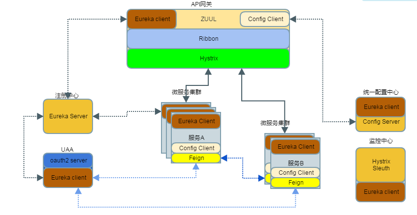

# 微服务框架

## 组件说明
### 服务端发现
1. 服务端
```
<dependency>
<groupId>org.springframework.cloud</groupId>
<artifactId>spring-cloud-starter-eureka-server</artifactId>
</dependency>
```
2. 客户端
```
<dependency>
<groupId>org.springframework.cloud</groupId>
<artifactId>spring-cloud-starter-eureka</artifactId>
</dependency>
```
### 配置
1. 服务端
```
<dependency>
<groupId>org.springframework.cloud</groupId>
<artifactId>spring-cloud-config-server</artifactId>
</dependency>
```
2. 客户端
```
<dependency>
<groupId>org.springframework.cloud</groupId>
<artifactId>spring-cloud-starter-config</artifactId>
</dependency>
```

### 路由
```
<dependency>
<groupId>org.springframework.cloud</groupId>
<artifactId>spring-cloud-starter-zuul</artifactId>
</dependency>
```
### 监控
#### 断路监控
1. 服务端
```
<dependency>
<groupId>org.springframework.cloud</groupId>
<artifactId>spring-cloud-starter-hystrix-dashboard</artifactId>
</dependency>
```
2. 客户端
```
<!-- 收集系统信息 -->
<dependency>
<groupId>org.springframework.boot</groupId>
<artifactId>spring-boot-starter-actuator</artifactId>
</dependency>
<!-- 断路监控 -->
<dependency>
<groupId>org.springframework.cloud</groupId>
<artifactId>spring-cloud-starter-hystrix</artifactId>
</dependency>
```
#### 链路追踪
1. 服务端
```
<dependency>
<groupId>io.zipkin.java</groupId>
<artifactId>zipkin-server</artifactId>
</dependency>

<dependency>
<groupId>io.zipkin.java</groupId>
<artifactId>zipkin-autoconfigure-ui</artifactId>
</dependency>
```
2. 客户端
```
<dependency>
<groupId>org.springframework.cloud</groupId>
<artifactId>spring-cloud-starter-zipkin</artifactId>
</dependency>
```

### 文档
```
<dependency>
<groupId>io.springfox</groupId>
<artifactId>springfox-swagger2</artifactId>
<version>2.2.2</version>
</dependency>
<dependency>
<groupId>io.springfox</groupId>
<artifactId>springfox-swagger-ui</artifactId>
<version>2.2.2</version>
</dependency>
```
### 其它
#### API网关动态路由更新
  1. 刷新配置
  ```
  post http://gateway-server:port/refresh
  ```
  2. 重新加载路由
  ```
  get/post http://gateway-server:port/routes
  ```
  > 
  > 需要关闭默认管理权限
  > management:  
  >    security:
  >     enabled: false

### token转发
#### 资源服务采用Feign调用其它服务
1. oauth2.resource
```
@EnableFeignClients
@EnableDiscoveryClient
@SpringBootApplication
@EnableResourceServer
public class Srv2ServerApplication {
    public static void main(String[] args) {
        SpringApplication.run(Srv2ServerApplication.class, args);
    }

    // Resource Server Token Relay
    // https://stackoverflow.com/questions/29439653/spring-cloud-feign-with-oauth2resttemplate

    @Bean
    public RequestInterceptor requestTokenBearerInterceptor() {
        return new RequestInterceptor() {
            @Override
            public void apply(RequestTemplate requestTemplate) {
                OAuth2AuthenticationDetails details = (OAuth2AuthenticationDetails)
                        SecurityContextHolder.getContext().getAuthentication().getDetails();

                requestTemplate.header("Authorization", "bearer " + details.getTokenValue());
            }
        };
    }

}
```

application.yml
```
security:
  sessions: stateless
  oauth2:
    resource:
      loadBalanced: true #必须要有 否则获取不到user信息
      user-info-uri:  http://uaa-server/uaa/user # auth-server 是注册到eureka的服务名称
      prefer-token-info: false # 不使用/oauth/check_token,因为不能负载均衡 使用在auth-server端实现的 /user api.
```
2. 使用 oauth2.client
```
@Bean
	@ConfigurationProperties(prefix = "security.oauth2.client")
	public ClientCredentialsResourceDetails clientCredentialsResourceDetails() {
		return new ClientCredentialsResourceDetails();
	}

	@Bean
	public RequestInterceptor oauth2FeignRequestInterceptor(){
		return new OAuth2FeignRequestInterceptor(new DefaultOAuth2ClientContext(), clientCredentialsResourceDetails());
	}

	@Bean
	public OAuth2RestTemplate clientCredentialsRestTemplate() {
		return new OAuth2RestTemplate(clientCredentialsResourceDetails());
	}
```
application.yml
```
security:
  oauth2:
    client:
      clientId: account-service
      clientSecret: ${ACCOUNT_SERVICE_PASSWORD}
      accessTokenUri: http://auth-service:5000/uaa/oauth/token
      grant-type: client_credentials
      scope: server
```
